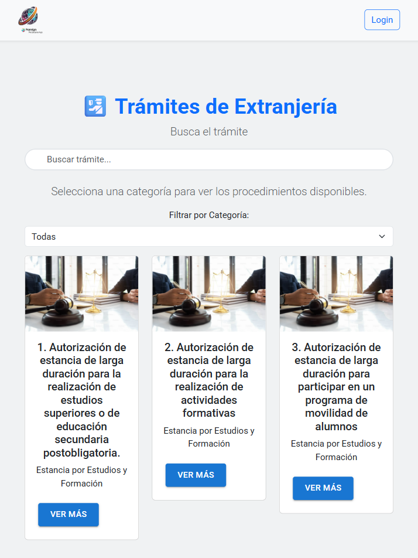
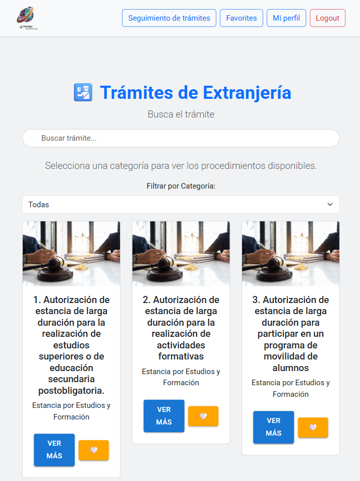
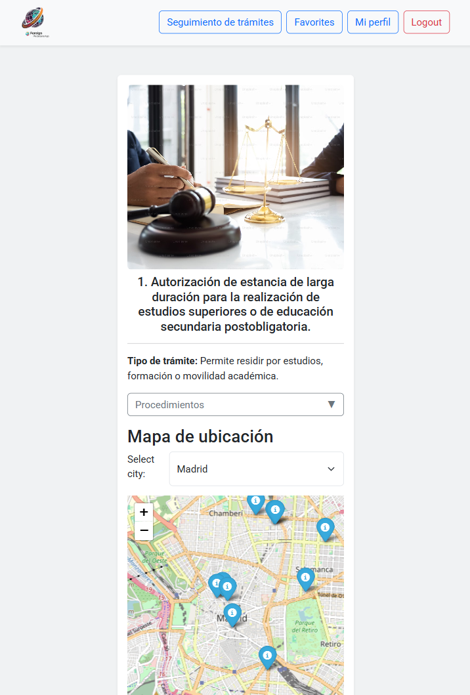
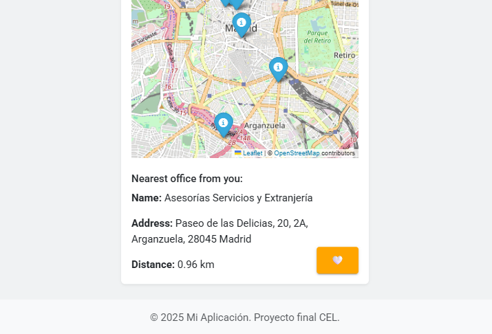

# Foreign Procedures: facilitating errands for those seeking for a better future

It is a web application designed to simplify and streamline the process of managing various administrative procedures and errands in a foreigner matter. From finding official information to tracking personal progress and locating relevant offices, this platform aims to reduce the complexity and frustration often associated with bureaucratic tasks. Users can search for specific errands, mark them as favorites, track their individual progress through forms, and locate essential government offices.

## Features

This project incorporates the following core functionalities, adhering to the project scope and requirements:

- User Authentication & Management:
  - Secure user registration.
  - Login/logout functionality.
  - Password reset mechanism (password encryption handled on the backend).
  - User profiles to manage personal information and tracked errands.
  - Detailed view for each errand, including procedures, requirements (links to official pages), and type classification.
  - Ability to mark errands as "Favorites" for quick access.
- Personalized Errand Tracking (Follow-up):
  - Users can initiate a "follow-up" for a specific errand, creating a personal instance to track their progress.
  - Status tracking for each follow-up (e.g., "Started" or "Completed").
  - Interactive forms for users to fill-in required information and save their progress for each follow-up (in progress).
- Office Location Integration:
  - Utilizes a third-party API (Google Places API) to find and display government offices (e.g., "Oficinas de Extranjería") based on user-selected locations (for now, Madrid, Barcelona or Valencia).
  - Interactive map to visualize office locations.
  - Asks for user's location to show closest office name and direction.
- Custom Backend API:
  - A robust Flask backend with a custom API to manage users, errands, favorites, and follow-ups.
  - Handles secure data transactions and API integrations.
- Aesthetic & Responsive Design:
  - A clean, intuitive, and mobile-responsive user interface, focusing on ease of use.
- Deployment:
  - The application will be deployed to a production environment.

### Data Scraping

To ensure the accuracy and completeness of errand details, **Foreign Procedures** includes a dedicated data scraping component. This component systematically extracts up-to-date information regarding foreign administrative procedures directly from the official Spanish government website: [https://www.inclusion.gob.es/web/migraciones/listado-completo](https://www.inclusion.gob.es/web/migraciones/listado-completo). This ensures that users always have access to the most current requirements and procedures.

## Project Structure

```bash
├── README.md                 # Project documentation
├── public/                   # Static assets for the React app
│   ├── offices_X.json        # Example office data when generated (X will be the city)
│   └── offices_mapX.html     # Example map HTML when generated (X will be the city)
└── src/                      # Source code for both backend and frontend
    ├── app.py                # Main Flask application instance and configuration.
    ├── extensions.py         # Flask extensions setup (flask-mail).
    ├── get_offices.py        # Used to request offices data from Google Places API
    ├── scraping.py           # Scraping from government website the errand details
    ├── wsgi.py
    ├── api/                  # Python Flask backend
    │   ├── models/           # Database models (User, Errand, Follow_up, etc.)
    │   ├── routes/           # API routes (endpoints)
    │   ├── admin.py          # Flask-Admin setup (if used)
    │   ├── commands.py       # Custom Flask CLI commands
    │   └── utils.py          # Utility functions for the backend
    └── front/                # React application
        ├── assets/           # Static assets specific to the frontend
        ├── components/       # Reusable React UI components (e.g., MapViewer, forms)
        ├── hooks/            # Custom React hooks (e.g., useGlobalReducer, useFavorites)
        ├── pages/            # React app pages (e.g., Home, ErrandDetail, MyFollowUps)
        └── services/         # Frontend services for API calls (e.g., favoritesServices)
```

## Project visualization

### Log in page:



### Home page:



### Errand detail page:




# Requirements

Install Python dependencies listed in `requirements.txt` and Node.js Package Manager:

```bash
pip install -r requirements.txt
npm install
```

# Getting Started

Follow these steps to run the application:

1. Clone the repository:

```bash
git clone https://github.com/4GeeksAcademy/Foreign-Procedures-App
cd Foreign-Procedures-App
```

2. Create API Key text file and add your Google Places API key

```bash
touch API_KEY
echo "YOUR_GOOGLE_PLACES_API_KEY_HERE" > API_KEY
```

3. Create Python environment

```bash
pipenv create
pipenv shell
```

4. Generate offices maps and data (check in `/public` folder)

```bash
python src/get_offices.py
```

5. Run backend

```bash
pipenv run migrate
pipenv run upgrade
pipenv run start
```

6. Run frontend

```bash
npm run start
```

Then, make them public on Ports tab.

7. Access the application
   Open your web browser and navigate to the URL provided by the frontend development server (e.g., `http://localhost:3000`).

8. Contact
   For inquiries, collaborations, or further information about Foreign Procedures, please contact:

Luis Oballos - `https://www.linkedin.com/in/luis-oballos-mancini/`.<br>
Cesar Arnetta - `https://www.linkedin.com/in/cesar-eduardo-arnetta/`.<br>
Eduardo Chavez - `https://www.linkedin.com/in/eduardo-chavez-lopez-57aa78146/`.<br>
